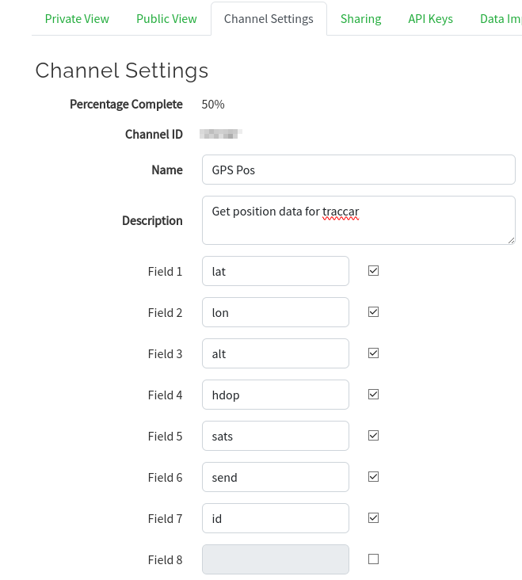
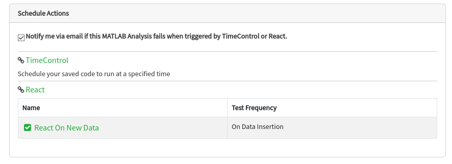
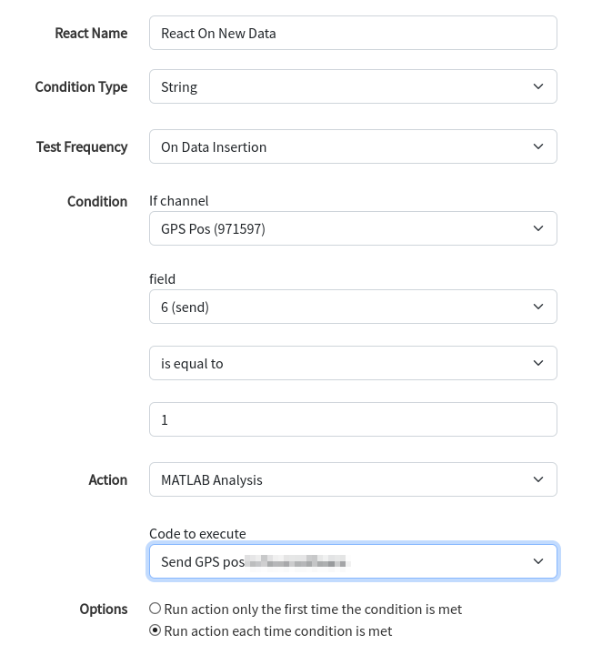

## TTGO T-Beam Tracker for The Things Network

Current version: 1.2.3

Uploads GPS data from the TTGO T-Beam to [The Things Network](https://www.thethingsnetwork.org) (TTN) and [TTN Mapper](https://ttnmapper.org) for tracking and determining signal strength of LoRaWAN gateways and nodes.

#### Based on the code from [xoseperez/ttgo-beam-tracker](https://github.com/xoseperez/ttgo-beam-tracker), with excerpts from [dermatthias/Lora-TTNMapper-T-Beam](https://github.com/dermatthias/Lora-TTNMapper-T-Beam) to fix an issue with incorrect GPS data being transmitted to The Things Network. I also added support for the 915 MHz frequency (North and South America). [lewisxhe/TTGO-T-Beam](https://github.com/lewisxhe/TTGO-T-Beam) was referenced for enabling use on the newer T-Beam board (Rev1).

This is a LoRaWAN node based on the [TTGO T-Beam](https://github.com/LilyGO/TTGO-T-Beam) development platform using the SSD1306 I2C OLED display.
It uses a RFM95 by HopeRF and the MCCI LoRaWAN LMIC stack. This sample code is configured to connect to The Things Network using the US 915 MHz frequency by default, but can be changed to EU 868 MHz.

NOTE: There are now 2 versions of the TTGO T-BEAM, the first version (Rev0) and a newer version (Rev1). The GPS module on Rev1 is connected to different pins than Rev0. This code has been successfully tested on REV0, and is in the process of being tested on REV1. See the end of this README for photos of eah board.

### Setup

The preferred method to install this library is via [PlatformIO](https://platformio.org/install), however the original instructions for installing with the Arduino IDE are below but YMMV.

1. Install visual studio code

2. Edit ```platformio.ini``` and uncomment the proper frequency for your region.

3. Edit this project file ```main/configuration.h``` and select your correct board revision, either T_BEAM_V07 or T_BEAM_V10 (see [T-BEAM Board Versions](#t-beam-board-versions) to determine which board revision you have).

4. Edit this project file ```main/credentials.h``` to use either ```USE_ABP``` or ```USE_OTAA``` and add the Keys/EUIs for your Application's Device from The Things Network.

6. Add the ``TTN Mapper integration`` to your Application (and optionally the Data Storage integration if you want to access the GPS location information yourself or use [TTN Tracker](#ttn-tracker), then add the Decoder code:

```C
function decodeUplink(input) {
    // Test Data: C46A14895B6301C21905
    var bytes = input.bytes;
    var port = input.fPort;
    var error = [];
    
    if (port != 10) {
      error.push("no uplink data");
      return {
        errors: error 
      };
    }
    var data = {};

    data.latitude = ((bytes[0]<<16)>>>0) + ((bytes[1]<<8)>>>0) + bytes[2];
    data.latitude = (data.latitude / 16777215.0 * 180) - 90;

    data.longitude = ((bytes[3]<<16)>>>0) + ((bytes[4]<<8)>>>0) + bytes[5];
    data.longitude = (data.longitude / 16777215.0 * 360) - 180;

    var altValue = ((bytes[6]<<8)>>>0) + bytes[7];
    var sign = bytes[6] & (1 << 7);
    if(sign) data.altitude = 0xFFFF0000 | altValue;
    else data.altitude = altValue;

    data.hdop = bytes[8] / 10.0;
    data.sats = bytes[9];
    
    data.id = ((bytes[10]<<8)>>>0) + bytes[11]
    
    data.field1 = data.latitude;
    data.field2 = data.longitude;
    data.field3 = data.altitude;
    data.field4 = data.hdop;
    data.field5 = data.sats;
    data.field6 = 1;
    data.field7 = data.id;
    
    return {
        data: data,
        warnings: [],
        errors: []
    }
}
```

7. Open this project directory ```./``` with visual studio code to compile and upload it to your TTGO T-Beam.

8. Turn on the device and once a GPS lock is acquired, the device will start sending data to TTN and TTN Mapper.

## Use t-beam to trac your car with https://www.traccar.org

Aditionaly to TTN Mapper you can trac your car (or what else) with traccar. To send data to the traccar API we use [ThingSpeak](https://thingspeak.com), which is free for use for non commercial tasks. With this soution we can use traccar without any sim card und use LoRaWAN instead.

1. Create an account on [ThingSpeak](https://thingspeak.com).

2. Create an new channel and add an MATLAB Analysis (custome code).

```C
%get posistion an send to traccar
import matlab.net.*
import matlab.net.http.*

readChannelID = 123456; % Channel ID of just created ThingSpeak channel

% Channel Read API Key   
% If your channel is private, then enter the read API Key between the '' below: 
readAPIKey = 'XXXXXXXXXXXXXXXX'; % read API key from just created ThingSpeak channel

[data, timeStamp] = thingSpeakRead(readChannelID, 'ReadKey',readAPIKey); 

lat = num2str(data(1));
lon = num2str(data(2));
alt = num2str(data(3));
id = num2str(data(7)); % last two bytes of devid

body = ['id=', id, '&lat=', lat, '&lon=', lon, '&altitude',  alt];

r = RequestMessage(matlab.net.http.RequestMethod.POST, '', body)
uri = URI('http://TRACCAR_SERVER_IP:5055')
resp = send(r,uri);
status = resp.StatusCode
```

3. Change ```TRACCAR_SERVER_IP``` adress, ```readChannelID``` und ```readAPIKey```. Port 5055 should be ok, this is for OsMand protocol.

4. Add channel settings


5. Add a Schedule Actions: Add react and configure code to execute to your matlab script we added in 2.



7. Add a new webhook integration in TheThingsNetwaork and fill in ThingSpeak channel-id and ThingSpeak write API key. You have to use the payload decoder from above in TheTingsNetwork, it also prepares data for ThingSpeak inetegration.

8. traccar and ttn-mapper can be used parallel. If you do not want to use ttn-mapper, do not add the ttn-mapper integration.

